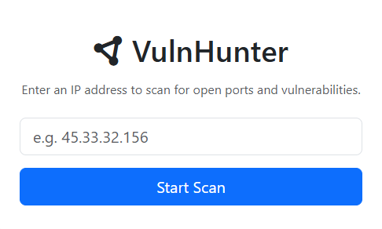
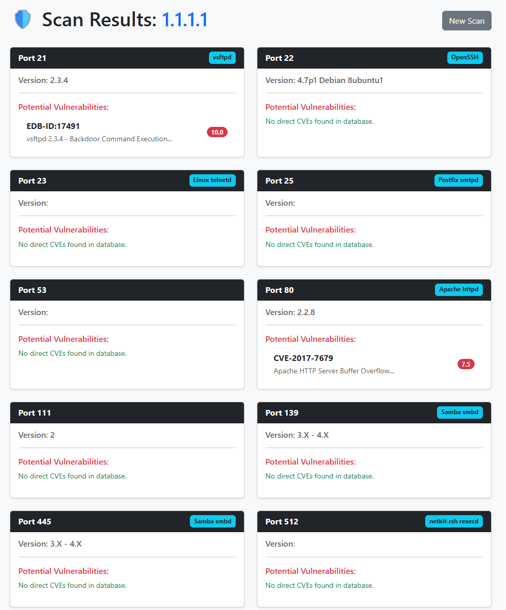

# 🕸️ VulnHunter - Network Vulnerability Scanner

## 🚀 Overview
**VulnHunter** is a Python-based reconnaissance tool that goes beyond simple port scanning. It scans target networks for open ports, identifies running services (Banner Grabbing), and cross-references version numbers against the Vulners database to identify real-time Common Vulnerabilities and Exposures (CVEs). 

All results are aggregated into a user-friendly Web Interface for easy analysis.

## 🛠️ Features
- **Port Scanning:** Identifies open ports and running services.
- **Service Enumeration:** Detects service versions (e.g., Apache 2.4.49).
- **Vulnerability Mapping:** Queries the Vulners database for CVEs.
- **Web Interface:** Clean, responsive dashboard built with Flask & Bootstrap.
- **Reporting:** Generates detailed HTML reports for each scan.

## ⚙️ Prerequisites
Before running the tool, you must have **Nmap** installed on your system:

- **Windows:** [Download the Nmap Installer](https://nmap.org/download.html)
- **Linux:**
  ```bash
  sudo apt-get install nmap
  ```
- **macOS:**
  ```bash
  brew install nmap
  ```

## 📦 Installation

### 1. Clone the Repository
```bash
git clone https://github.com/zhuiasdh/Vuln-Hunter.git
cd Vuln-Hunter
```

### 2. Install Dependencies
```bash
pip install -r requirements.txt
```

### 3. Configure API Key
Create a `.env` file in the root directory and add your Vulners API key:
```bash
VULNERS_API_KEY="your_api_key_here"
```

## 🚀 Usage

1. **Start the Flask Application**
   ```bash
   python app.py
   ```

2. **Open your browser**
   Navigate to: [http://127.0.0.1:5000](http://127.0.0.1:5000)

3. **Run a Scan**
   Enter a Target IP (e.g., `192.168.1.1` or your local VM IP) to begin.

## 📸 Project Demo

### 1. The Dashboard Interface


### 2. Critical Vulnerability Report


---

Developed by Ziyi

## ⚠️ Legal Disclaimer
**Usage of VulnHunter for attacking targets without prior mutual consent is illegal.** It is the end user's responsibility to obey all applicable local, state, and federal laws. Developers assume no liability and are not responsible for any misuse or damage caused by this program.

